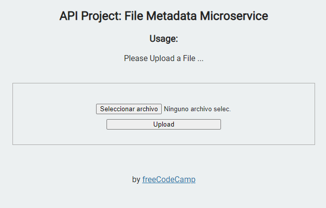

# File Metadata Microservice

This is the boilerplate solved code for the File Metadata Microservice project. Instructions for building this project can be found at https://www.freecodecamp.org/learn/apis-and-microservices/apis-and-microservices-projects/file-metadata-microservice

